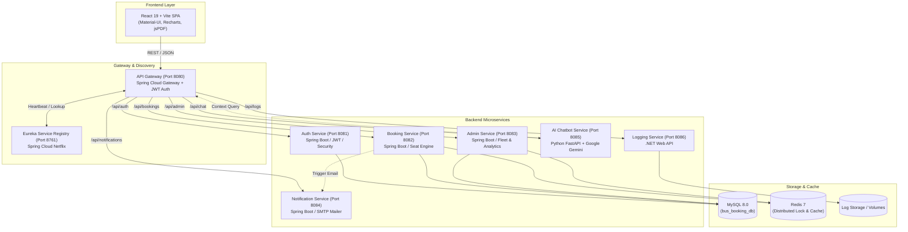

# 🚌 EasyTravel - Cloud-Native Microservices Bus Booking Platform

[](https://react.dev/)
[](https://spring.io/projects/spring-boot)
[](https://fastapi.tiangolo.com/)
[](https://dotnet.microsoft.com/)
[](https://www.docker.com/)
[](https://kubernetes.io/)
[](https://www.jenkins.io/)
[](https://www.mysql.com/)
[](https://redis.io/)

**EasyTravel** is a modern, enterprise-grade, polyglot microservices platform designed for seamless bus ticketing, real-time seat reservation, dynamic route management, automated notifications, and AI-assisted customer support.

---

## 📌 Table of Contents

- [System Architecture](#-system-architecture)
- [Key Features](#-key-features)
- [Tech Stack](#-tech-stack)
- [Service Topology & Ports](#-service-topology--ports)
- [Project Directory Structure](#-project-directory-structure)
- [Environment Configuration](#-environment-configuration)
- [Getting Started](#-getting-started)
  - [Option 1: Docker Compose (Recommended)](#1-docker-compose-quickstart)
  - [Option 2: Local Development (Native Scripts)](#2-local-development-windows-batch)
  - [Option 3: Kubernetes Deployment](#3-kubernetes-k8s-deployment)
  - [Option 4: Automated CI/CD with Jenkins](#4-automated-cicd-with-jenkins)
- [API Gateway Routing](#-api-gateway-routing)
- [Security & Best Practices](#-security--best-practices)
- [Contributing](#-contributing)
- [License](#-license)

---

## 🏛️ System Architecture

EasyTravel is architected using a decoupled **polyglot microservices pattern**, utilizing Spring Cloud Gateway for unified ingress, Netflix Eureka for dynamic discovery, Redis for distributed seat locks, and asynchronous integrations for AI and notifications.



---

## ✨ Key Features

### 👤 Passenger Experience
* **Smart Bus Search**: Filter by origin, destination, departure date, bus operator, and amenities.
* **Interactive 2D Seat Layout**: Real-time visual seat map supporting sleeper, semi-sleeper, and seater configurations.
* **Concurrency-Safe Seat Locking**: Redis-backed temporary seat lock prevents double booking during checkout.
* **Instant Digital Tickets**: Generates printable PDF tickets with dynamic QR codes for check-in verification.
* **Automated Email Confirmations**: HTML ticket confirmation dispatched instantly upon payment.
* **AI Travel Concierge**: Built-in chatbot powered by **Google Gemini Pro** and **OpenWeatherMap** for travel tips, route planning, and live destination weather forecast.

### 🛠️ Admin & Fleet Management
* **Operations Dashboard**: Real-time metrics for total revenue, active trips, occupancy rates, and passenger count.
* **Fleet & Bus Master**: Complete CRUD operations for buses, seat layouts, and vehicle types.
* **Route & Schedule Management**: Create routes, define intermediate stops, and set dynamic departure schedules.
* **Dynamic Pricing Engine**: Configure base fares, holiday surges, and promotional discounts.
* **Advanced Analytics**: Visual revenue and booking trend graphs via Recharts.

### 🛡️ Enterprise DevOps & Reliability
* **Centralized API Gateway**: Single point of ingress handling JWT validation, rate limiting, and CORS.
* **High Availability & Auto-Recovery**: Kubernetes manifests with readiness/liveness probes and HPA.
* **CI/CD Automation**: Fully parameterized Jenkins Pipeline for automated build, test, Docker image push, and K8s rolling deployment.
* **Polyglot Centralized Logging**: Dedicated .NET logging service capturing system diagnostics across all components.

---

## 💻 Tech Stack

| Layer | Technology |
| :--- | :--- |
| **Frontend** | React 19, Vite, Material-UI (MUI v9), Emotion, Recharts, jsPDF, Axios, React Router v7 |
| **API Gateway & Discovery** | Spring Cloud Gateway (Reactive), Spring Cloud Netflix Eureka |
| **Backend Microservices** | Java 17/21 (Spring Boot 3, Spring Security, Spring Data JPA, Spring Mail) |
| **AI & Helper Services** | Python 3.11+ (FastAPI, Google Gemini SDK, OpenWeatherMap API) |
| **System Logging** | .NET 8 / C# Web API |
| **Databases & Cache** | MySQL 8.0 (Relational), Redis 7 (In-Memory Cache & Distributed Lock) |
| **DevOps & Containers** | Docker, Docker Compose, Kubernetes, Helm, NGINX Ingress, Jenkins CI/CD |

---

## 🌐 Service Topology & Ports

| Service Name | Port | Protocol | Description |
| :--- | :--- | :--- | :--- |
| **Frontend Web App** | `80` / `5173` | HTTP | React SPA User & Admin Interface |
| **API Gateway** | `8080` | HTTP | Unified Ingress Point & JWT Authentication Filter |
| **Eureka Server** | `8761` | HTTP | Service Registry & Health Dashboard |
| **Auth Service** | `8081` | HTTP | User Registration, Login, Token Generation & Profile |
| **Booking Service** | `8082` | HTTP | Reservation Engine, Seat Availability & Locking |
| **Admin Service** | `8083` | HTTP | Fleet Management, Bus Schedules & Analytics |
| **Notification Service** | `8084` | HTTP | SMTP Email Dispatcher |
| **AI Chatbot Service** | `8085` | HTTP | Gemini AI Travel Guide & Weather Bot |
| **Logging Service** | `8086` | HTTP | Centralized Audit & Log Aggregation |
| **MySQL Server** | `3306` | TCP | Relational Database Engine (`bus_booking_db`) |
| **Redis Cache** | `6379` | TCP | In-Memory Data Store & Fast Lock Engine |

---

## 📂 Project Directory Structure

```text
├── .env.example                     # Environment variables configuration template
├── docker-compose.yml               # Complete multi-service Docker Compose definition
├── deploy.sh                        # Automated deployment script for Unix/Linux
├── start_all.bat                    # One-click Windows startup script for all services
├── stop_all.bat                     # Windows cleanup / stop script
├── Jenkinsfile                      # Multi-stage CI/CD pipeline definition
├── AWS_DEPLOYMENT_GUIDE.md          # Cloud infrastructure deployment guide for AWS
├── K8S_JENKINS_DEPLOYMENT_GUIDE.md  # Detailed Kubernetes & Jenkins setup guide
│
├── frontend/                        # React 19 Frontend Application
│   ├── src/                         # UI Components, Pages, State & Services
│   ├── Dockerfile                   # Multi-stage Nginx build for Frontend
│   └── package.json                 # Node dependencies and build scripts
│
├── Backend/                         # Microservices Backend Root
│   ├── eureka-server/               # Spring Cloud Netflix Discovery Server (8761)
│   ├── api-gateway/                 # Spring Cloud API Gateway (8080)
│   ├── auth-service/                # Authentication & User Management (8081)
│   ├── booking-service/             # Seat Reservation & Booking Lifecycle (8082)
│   ├── admin-service/               # Bus Fleet, Schedules & Analytics (8083)
│   ├── notification-service/        # Email Notification Worker (8084)
│   ├── chatbot-service/             # Python FastAPI Gemini AI Assistant (8085)
│   └── LoggingService/              # .NET Centralized Logging Engine (8086)
│
├── k8s/                             # Production Kubernetes Manifests
│   ├── 00-namespace.yaml            # easy-travel namespace
│   ├── 01-secrets-and-configmap.yaml# Secrets & environment configurations
│   ├── 02-storage-and-databases.yaml# MySQL & Redis PVCs and Stateful workloads
│   ├── 03-discovery-gateway.yaml    # Eureka Server & API Gateway Deployments
│   ├── 04-backend-services.yaml     # Microservices Deployments & Services
│   ├── 05-frontend.yaml             # React Frontend Deployment & Service
│   ├── 06-ingress.yaml              # NGINX Ingress Controller rules
│   └── 07-jenkins.yaml              # Jenkins CI/CD controller deployment in K8s
│
└── setup/                           # Database init scripts and assets
```

---

## ⚙️ Environment Configuration

1. Create your `.env` file from the provided template:
   ```bash
   cp .env.example .env
   ```

2. Fill in the required environment variables:
   ```ini
   # --- MySQL Database ---
   DB_USERNAME=root
   DB_PASSWORD=your_secure_mysql_password

   # --- JWT Secret (32+ characters, shared by Auth Service & API Gateway) ---
   JWT_SECRET=your_super_secret_jwt_key_minimum_32_characters_long

   # --- Gmail SMTP (For Notification Service) ---
   GMAIL_USERNAME=your_email@gmail.com
   GMAIL_APP_PASSWORD=your_gmail_app_password

   # --- Python AI Chatbot ---
   GEMINI_API_KEY=your_google_gemini_api_key
   OPENWEATHER_API_KEY=your_openweather_api_key
   API_GATEWAY_URL=http://localhost:8080/api
   ```

> ⚠️ **Important**: Never commit `.env` or plain-text credentials to version control. The `.gitignore` is preconfigured to ignore local environment files.

---

## 🚀 Getting Started

### 1. Docker Compose Quickstart

The fastest way to spin up the entire EasyTravel ecosystem (all 9 microservices + MySQL + Redis):

```bash
# Clone the repository
git clone https://github.com/<your-username>/EasyTravel.git
cd EasyTravel

# Copy and configure environment variables
cp .env.example .env

# Build and start all containers in detached mode
docker-compose up --build -d

# Verify container health
docker-compose ps
```

* **Frontend Web App**: [http://localhost](http://localhost) (or [http://localhost:5173](http://localhost:5173))
* **API Gateway**: [http://localhost:8080](http://localhost:8080)
* **Eureka Registry**: [http://localhost:8761](http://localhost:8761)

To stop all services:
```bash
docker-compose down -v
```

---

### 2. Local Development (Windows Batch)

For active local development with hot-reloading:

1. Ensure prerequisites are installed: **Java 17/21**, **Node.js 18+**, **Python 3.11+**, **.NET 8/10 SDK**, **MySQL**, and **Redis**.
2. Run the automated Windows launcher:
   ```cmd
   start_all.bat
   ```
   *This initializes Eureka, starts each microservice in a dedicated terminal window with environment variables, and launches the Vite React frontend.*
3. To stop all local processes:
   ```cmd
   stop_all.bat
   ```

---

### 3. Kubernetes (K8s) Deployment

Deploy the entire suite onto any Kubernetes cluster (Minikube, Kind, AWS EKS, AKS, GKE):

```bash
# 1. Apply namespace
kubectl apply -f k8s/00-namespace.yaml

# 2. Apply ConfigMaps and Secrets
kubectl apply -f k8s/01-secrets-and-configmap.yaml

# 3. Deploy Databases & Storage (MySQL & Redis)
kubectl apply -f k8s/02-storage-and-databases.yaml

# 4. Deploy Discovery & API Gateway
kubectl apply -f k8s/03-discovery-gateway.yaml

# 5. Deploy Backend Microservices
kubectl apply -f k8s/04-backend-services.yaml

# 6. Deploy React Frontend
kubectl apply -f k8s/05-frontend.yaml

# 7. Apply Ingress Routing
kubectl apply -f k8s/06-ingress.yaml
```

**Check deployment status:**
```bash
kubectl get pods -n easytravel
kubectl get svc -n easytravel
```

---

### 4. Automated CI/CD with Jenkins

The included `Jenkinsfile` provides an end-to-end continuous integration and continuous deployment pipeline:

1. **Checkout**: Pulls latest code from Git repository.
2. **Build & Test**: Compiles Java services with Maven, runs unit tests, and packages .NET/Python components.
3. **Containerize**: Builds optimized multi-stage Docker images for each service.
4. **Push**: Publishes images tagged with build numbers to Docker Hub / Container Registry.
5. **Deploy**: Automatically applies Kubernetes manifests to the target cluster with zero-downtime rolling updates.

Refer to [`K8S_JENKINS_DEPLOYMENT_GUIDE.md`](./K8S_JENKINS_DEPLOYMENT_GUIDE.md) for step-by-step Jenkins credentials and pipeline setup.

---

## 🗺️ API Gateway Routing

All client requests flow through the **API Gateway** (`http://localhost:8080`):

| Route Path | Target Microservice | Description |
| :--- | :--- | :--- |
| `/api/auth/**` | `auth-service` | User authentication, registration, JWT refresh |
| `/api/bookings/**` | `booking-service` | Seat reservations, booking records, cancellations |
| `/api/admin/**` | `admin-service` | Bus, route, schedule management, revenue stats |
| `/api/notifications/**` | `notification-service` | Email dispatches, confirmation alerts |
| `/api/chat/**` | `chatbot-service` | Google Gemini AI assistant & weather info |
| `/api/logs/**` | `logging-service` | Centralized audit logs and event capture |

---

## 🔒 Security & Best Practices

- **Stateless Authentication**: Uses standard JSON Web Tokens (JWT) with signature validation at the API Gateway level.
- **Role-Based Access Control (RBAC)**: Distinct permissions for `ROLE_USER` and `ROLE_ADMIN`.
- **Password Hashing**: BCrypt encryption for user credentials stored in MySQL.
- **Resource Constraints**: Kubernetes deployments include defined CPU/Memory `requests` and `limits`.
- **Health Checks & Probes**: Readiness and liveness probes configured for zero-downtime rolling updates.

---

## 🤝 Contributing

Contributions are welcome! Follow these steps:

1. **Fork the Repository**
2. **Create a Feature Branch**: `git checkout -b feature/amazing-feature`
3. **Commit your Changes**: `git commit -m 'Add some amazing feature'`
4. **Push to the Branch**: `git push origin feature/amazing-feature`
5. **Open a Pull Request**

---

## 📄 License

This project is licensed under the [MIT License](LICENSE) - feel free to use and adapt it for personal and enterprise projects.
